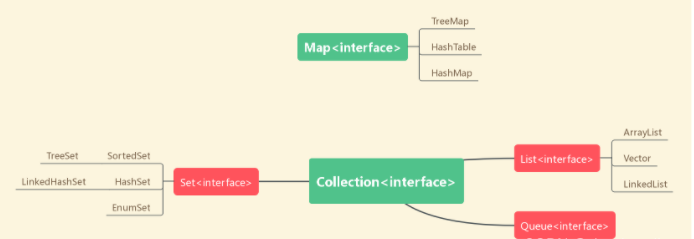

## JAVA容器篇：「Map」详解（

### 一、容器的概念

- ##### 什么是容器

  在Java当中，有一个类专门用来存放其它类的对象，这个类就叫做容器，它就是将若干性质相同或相近的类对象组合在一起而形成的一个整体 。如图一所示。

- ##### 常用的Java容器




  本期我们主要讲解的是Map接口，主要分为TreeMap、HashMap。具体部分由下文娓娓道来。

### 二、Map详解

###   1.**Map 接口概述**

- **定义**：Map<K, V> 是一个泛型接口，其中 K 表示键的类型，V 表示值的类型。

- 特点

  ：

  - 键（key）必须是唯一的，重复的键会被覆盖。
  - 值（value）可以重复。
  - Map 不继承 Collection 接口，但与 Collection 家族（如 List 和 Set）密切相关。

- **主要用途**：存储和快速查找键值对数据，例如字典、配置文件、计数器等。

------

###   2. **常用实现类**

Map 接口有多个实现类，每个实现类有不同的特性：

- HashMap：
  - 基于哈希表实现。
  - 键值对无序（插入顺序可能不保留）。
  - 允许 null 键和 null 值（但只有一个 null 键）。
  - 时间复杂度：平均 O(1)（查找、插入、删除）。
- TreeMap：
  - 基于红黑树实现。
  - 键值对按键的自然顺序（或自定义比较器）排序。
  - 不允许 null 键（但允许 null 值，取决于 JDK 版本）。
  - 时间复杂度：O(log n)。
- LinkedHashMap：
  - 基于哈希表和双向链表实现。
  - 保留插入顺序（或访问顺序，取决于构造参数）。
  - 允许 null 键和 null 值。
  - 时间复杂度：平均 O(1)。
- Hashtable（已较少使用）：
  - 线程安全的 HashMap 实现（同步方法）。
  - 不允许 null 键和 null 值。
  - 时间复杂度：平均 O(1)。
  - 已被 ConcurrentHashMap 替代。


### 三、HashMap主要方法

​       [java Map类官方文档](https://docs.oracle.com/javase/8/docs/api/?xd_co_f=47c934d9-e663-4eba-819c-b726fc2d0847)

 HashMap常用方法：

####   常用方法

- put(K key, V value）：
  - 将键值对添加到 Map 中，如果键已存在，则覆盖旧值并返回旧值。
  - 示例：map.put("apple", 5);
- get(Object key)：
  - 根据键获取对应的值，如果键不存在，返回 null。
  - 示例：Integer value = map.get("apple");
- getOrDefault(Object key, V defaultValue)：
  - 获取键对应的值，如果键不存在，返回默认值。
  - 示例：Integer value = map.getOrDefault("banana", 0);
- remove(Object key)：
  - 删除指定键及其对应的值，返回被删除的值（如果键不存在，返回 null）。
  - 示例：map.remove("apple");
- containsKey(Object key)：
  - 检查 Map 中是否包含指定键，返回 boolean。
  - 示例：boolean hasKey = map.containsKey("apple");
- containsValue(Object value)：
  - 检查 Map 中是否包含指定值，返回 boolean。
  - 示例：boolean hasValue = map.containsValue(5);
- size()：
  - 返回 Map 中的键值对数量。
  - 示例：int size = map.size();
- isEmpty()：
  - 检查 Map 是否为空，返回 boolean。
  - 示例：boolean empty = map.isEmpty();
- clear()：
  - 移除所有键值对。
  - 示例：map.clear();

#### 遍历方法

- keySet()：
  - 返回所有键的 Set 视图。
  - 示例：for (String key : map.keySet()) {...}
- values()：
  - 返回所有值的 Collection 视图。
  - 示例：for (Integer value : map.values()) {...}
- entrySet()：
  - 返回所有键值对的 Set 视图（每个元素是 Map.Entry 对象）。
  - 示例：for (Map.Entry<String, Integer> entry : map.entrySet()) {...}

#### 示例 Map.Entry 方法

```java
import java.util.HashMap;
import java.util.Map;

public class Main {
    public static void main(String[] args) {
        // 创建一个 HashMap
        Map<String, Integer> map = new HashMap<>();

        // 添加键值对
        map.put("Alice", 1);
        map.put("Bob", 2);
        map.put("Charlie", 3);
        map.put("Alice", 4); // 覆盖原来的值
        System.out.println("Size: " + map.size()); // 输出: Size: 3
    
        // 获取值
        System.out.println("Alice's count: " + map.get("Alice")); // 输出: Alice's count: 4
        System.out.println("David's count: " + map.get("David")); // 输出: David's count: null
        System.out.println("Default for David: " + map.getOrDefault("David", 0)); // 输出: Default for David: 0
    
        // 检查键是否存在
        System.out.println("Contains Bob: " + map.containsKey("Bob")); // 输出: Contains Bob: true
    
        // 删除键值对
        map.remove("Bob");
        System.out.println("Size after remove: " + map.size()); // 输出: Size after remove: 2
    
        // 遍历键
        System.out.println("Keys:");
        for (String key : map.keySet()) {
            System.out.println(key);
        }
        // 输出: Keys: Alice, Charlie
    
        // 遍历值
        System.out.println("Values:");
        for (Integer value : map.values()) {
            System.out.println(value);
        }
        // 输出: Values: 4, 3
    
        // 遍历键值对
        System.out.println("Entries:");
        for (Map.Entry<String, Integer> entry : map.entrySet()) {
            System.out.println(entry.getKey() + ": " + entry.getValue());
        }
        // 输出: Entries: Alice: 4, Charlie: 3
    
        // 修改值
        map.put("Charlie", 5);
        System.out.println("Updated Charlie: " + map.get("Charlie")); // 输出: Updated Charlie: 5
    }

}
```


### 四、真题举例

 [7.神秘数对](https://www.lanqiao.cn/problems/3614/learning/?page=1&first_category_id=1&tags=STL&tag_relation=union)

### 问题描述

给你一个长度为 n*n* 的数组 a=*a*= {a1,a2,...,an*a*1,*a*2,...,*a**n*}，以及一个整数 k*k*。

下面给出神秘数对的定义：

对于 (1≤i<j≤n)(1≤*i*<*j*≤*n*)，满足 ai×aj+3×aj−7=k+5+4×ai*a**i*×*a**j*+3×*a**j*−7=*k*+5+4×*a**i*，则称 (i,j)(*i*,*j*) 是神秘数对。

现在需要你计算出数组 a*a* 中有多少个神秘数对？

### 输入格式

输入共两行。

第一行输入两个整数 n,k*n*,*k*，分别表示数组长度 ，式子中的一个常量。

第二行输入 n*n* 个整数 ai(1≤i≤n)*a**i*(1≤*i*≤*n*)，代表数组中的 n*n* 个元素。

### 输出格式

输出共一行，表示你计算出的数组 a*a* 中的神秘数对的总数。

### 样例输入

```
4 8
-1 -1 8 8
```

### 样例输出

```
4
```

### 说明

一共有 44 对神秘数对：(1,3)(1,3)，(1,4)(1,4)，(2,3)(2,3)，(2,4)(2,4)。

### 评测数据规模

对于所有评测数据，1≤n≤1061≤*n*≤106，−109≤k≤109−109≤*k*≤109，−109≤ai≤109。−109≤*a**i*≤109。

```java
import java.util.Map;
import java.util.Scanner;
import java.util.HashMap;
// 1:无需package
// 2: 类名必须Main, 不可修改

public class Main {
    public static void main(String[] args) {
        Scanner scan = new Scanner(System.in);
        int n,k,res=0;
        n = scan.nextInt();
        int[] a= new int[n];
        Map<Integer,Integer> map = new HashMap<>();
        k = scan.nextInt();
        for(int i=0 ;i<n;i++) {
            a[i] = scan.nextInt();
        }
        //通过化简得出 （ai-4）（aj+3）=k；
        for(int i=0 ;i<n ;i++) {
            if (a[i] - 4 == 0) {
                if (k == 0) {
                    res = i + res;
                    }
                } else
                      {
                    if (k % (a[i] - 4) == 0) { //寻找到合理的aj
           int target = k / (a[i] - 4); //找到专属于这个a【i】的a【j】,为前面配对，作为a【j】
           res = res + map.getOrDefault(target, 0);//先加res，再加key++
                    }
                }
                int key = a[i] + 3;//为后面配对，作为a【i】
                map.put(key, map.getOrDefault(key, 0) + 1);
            }

        System.out.print(res);
        scan.close();
    }
}
```

做本题时，笔者遇到难题较多：

- 使用Map时，需要引用util.HashMap等包，未避免拼写错误，可直接使用

  ```
  import java.util.*;
  ```

- 未将等式化简，增添思考难度

- 无法理解以下两段代码

  ```java
  int target = k / (a[i] - 4); //找到专属于这个a【i】的a【j】,为前面配对，作为a【j】
  res = res + map.getOrDefault(target, 0);//先加res，再加key++
  ```

  ```
  int key = a[i] + 3;//为后面配对，作为a【i】
  map.put(key, map.getOrDefault(key, 0) + 1);
  ```

- 不理解**map.getOrDefault(key, 0) + 1);**的作用与含义

  ```
  map.getOrDefault(key, 0) + 1);
  ```

  

### 五、本题思路

1. 定义一个 map<int, int> 来存储某些值的频率。
2. 读取整数 n（数组大小）和 k（目标值）。
3. 读取一个从索引 1 到 n 的数组 a。
4. 遍历数组，对于每个元素a[i]：
   - 如果 a[i] - 4 == 0 且 k == 0，则将 i - 1（即 i 之前的元素数量）加到 ans 上。
   - 否则，如果 (a[i] - 4) 能整除 k，则将 map 中键为 k / (a[i] - 4) 的值加到 ans 上。
   - 更新 map，将 a[i] + 3 的频率加 1。
5. 最后输出 ans，其类型为 long long。

代码的目的是计算满足公式 (a[i] - 4) * (a[j] + 3) = k 的有序对 (j, i)（其中 j < i）的数量。
